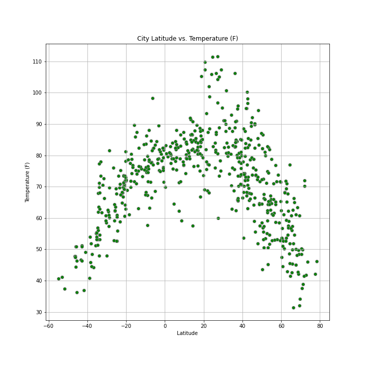
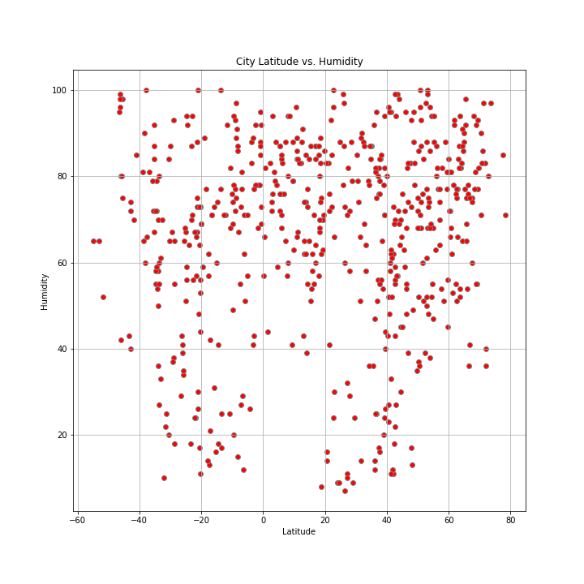
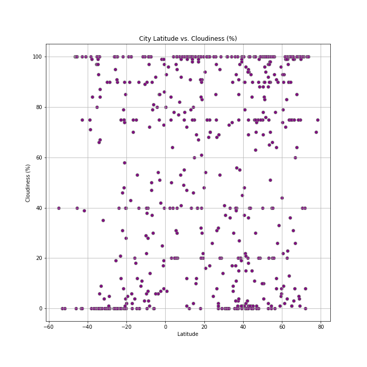
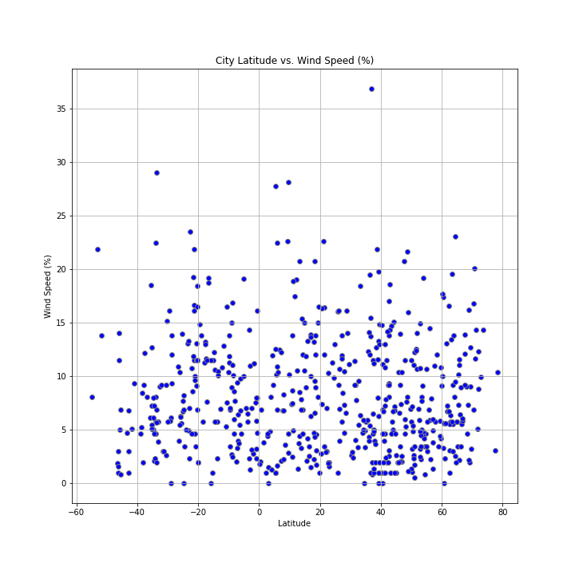
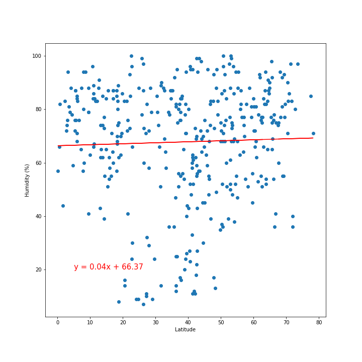
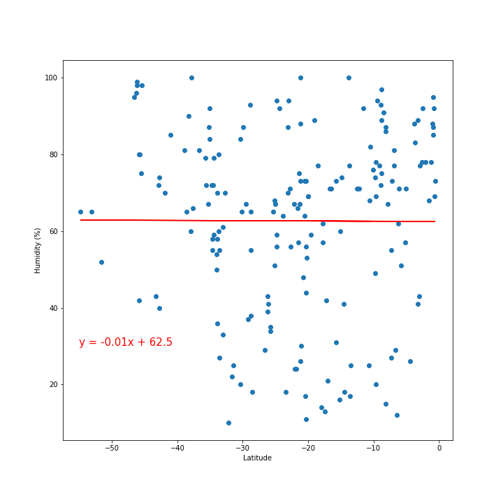
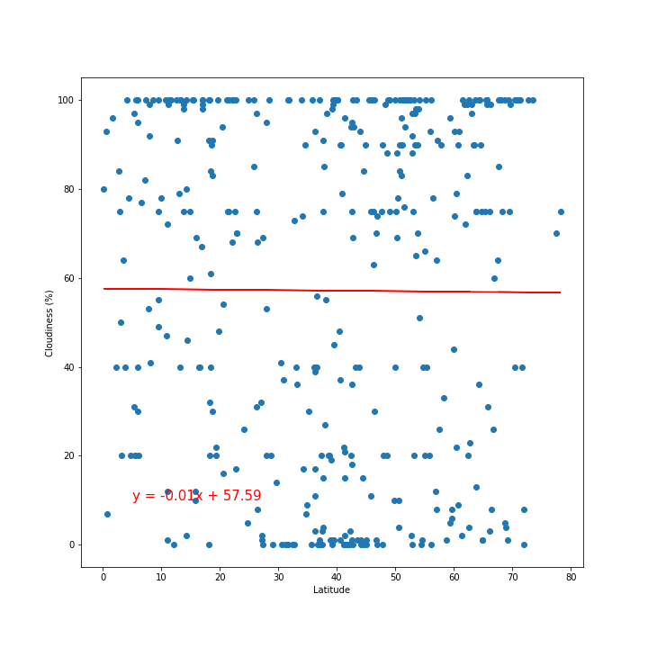

# Vacation Weather

## Background

Whether financial, political, or social -- data's true power lies in its ability to answer questions definitively. Utilize Python requests, APIs, and JSON traversals to answer a fundamental question: "What's the weather like as we approach the equator?"

Now, we know what you may be thinking: _"Duh. It gets hotter..."_

But, if pressed, how would you **prove** it?

## Part I - WeatherPy

Create a Python script to visualize the weather of 500+ cities across the world of varying distance from the equator, utilizing a [simple Python library](https://pypi.python.org/pypi/citipy), the [OpenWeatherMap API](https://openweathermap.org/api), and a little common sense to create a representative model of weather across world cities.

### Create a series of scatter plots to showcase the following relationships:

* Temperature (F) vs. Latitude

* Humidity (%) vs. Latitude

* Cloudiness (%) vs. Latitude

* Wind Speed (mph) vs. Latitude

These charts show some relationship between temperature and latitude; however, humidity, cloudiness, and wind speed does not appear to be impacted by latitude. 

### Run linear regression on each relationship, only this time separating them into Northern Hemisphere (greater than or equal to 0 degrees latitude) and Southern Hemisphere (less than 0 degrees latitude):

* Northern Hemisphere - Temperature (F) vs. Latitude

* Southern Hemisphere - Temperature (F) vs. Latitude

These two charts show temperatures rise until around 30 degrees latitude in the northern hemiphere and decrease to either side. This confirms the relationship in the Temperature vs Latitude scatter plot above. 

* Northern Hemisphere - Humidity (%) vs. Latitude

* Southern Hemisphere - Humidity (%) vs. Latitude

These two charts show slightly opposite trend of humidity in relation to the equator. The random city selection also appears to be significantly heavier northen hemisphere based, which may skew the analysis.

* Northern Hemisphere - Cloudiness (%) vs. Latitude

* Southern Hemisphere - Cloudiness (%) vs. Latitude

These two charts show a barely noticeable, slightly opposite trend of cloudiness in relation to the equator. The random city selection also appears to be significantly heavier northen hemisphere based, which may skew the analysis. The northern hemisphere shows multiple cities at 0% and multiple cities at 100% with no pattern to scatter within the middle. The southern hemisphere has more cities at 0% than at any other percentage, but still a few more.  

* Northern Hemisphere - Wind Speed (mph) vs. Latitude

* Southern Hemisphere - Wind Speed (mph) vs. Latitude

These two plots show greater wind in the southern artic region with an overall trend diminishing moving toward the equator. The northern hemisphere shows hardly any change in wind speed, but on average wind is greater in the north.  

## Part II - VacationPy

Working with weather data to plan future vacations using jupyter-gmaps and Google Places API.

### Create a heat map that displays the humidity for every city from the part I of the homework.

  

### Narrow down the DataFrame to find your ideal weather condition. 

  * A max temperature lower than 85 degrees but higher than 70.

  * Wind speed less than 10 mph.

  * Zero cloudiness.

  * Drop any rows that don't contain all three conditions. You want to be sure the weather is ideal.

### Using Google Places API to find the first hotel for each city located within 5000 meters of your coordinates.

### Plot the hotels on top of the humidity heatmap with each pin containing the **Hotel Name**, **City**, and **Country**.

